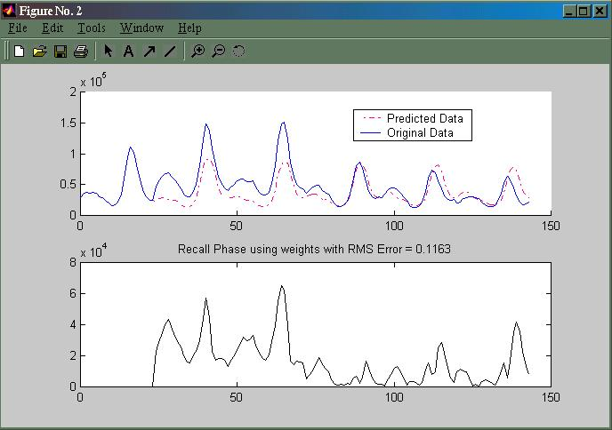

<div align="center">

## Predictor


</div>

### Description

This source code was originally to predict lightning strikes. This source code is run in MATLAB and can be modified for different no of inputs. Meaning, this source code can be used for any kind of prediction!
 
### More Info
 
The code is in two parts. The training and recall phase (see the source codes for both are given) make up the whole prediction. The training requires a series of input values of the parameter intended for prediction. The recall phase requires the saved weights from the training phase.

The user needs a basic understanding of Neural Networks and Back Propagation Theory.

The code returns a nice prediction graphically plotted with MATLAB.


<span>             |<span>
---                |---
**Submitted On**   |
**By**             |[Sara Khoo](https://github.com/Planet-Source-Code/PSCIndex/blob/master/ByAuthor/sara-khoo.md)
**Level**          |Advanced
**User Rating**    |4.0 (12 globes from 3 users)
**Compatibility**  |VB 6\.0
**Category**       |[Databases/ Data Access/ DAO/ ADO](https://github.com/Planet-Source-Code/PSCIndex/blob/master/ByCategory/databases-data-access-dao-ado__1-6.md)
**World**          |[Visual Basic](https://github.com/Planet-Source-Code/PSCIndex/blob/master/ByWorld/visual-basic.md)
**Archive File**   |[](https://github.com/Planet-Source-Code/sara-khoo-predictor__1-33422/archive/master.zip)


### Source Code

```
%Hidden Layer - Gaussian Activation Function
%Input and Output Layers - Linear
%MaxDataNo = No. of Years x 24
%Open and read file
disp(' ');
file=input('Please enter path of data file:', 's');
fid=fopen(file,'rt');
[DataArray]=fscanf(fid,'%d');
x=max(DataArray);
DataArray=DataArray/x;
DataArray2=DataArray;
%Initialization
InputUnitNo=24;
HiddenUnitNo=10;
OutputUnitNo=1;
MaxDataNo=120;
MaxPatternNo=MaxDataNo-InputUnitNo;
Eta=0.2;
Alpha=0.2;
Error=0.13;
Epoch=0;
RMSError=1;
%Weights
bias_k=rand(OutputUnitNo,1);
dbias_k=0;
bias_j=rand(HiddenUnitNo,1);
dbias_j=0;
vji=rand(HiddenUnitNo,InputUnitNo);
dvji=0;
wkj=rand(OutputUnitNo,HiddenUnitNo);
dwkj=0;
while RMSError>Error,
  if Epoch>1000,
   break;
  else
   for i=1:MaxPatternNo,
     %Start to learn
     Input=DataArray2(i:i+23);
     Target=DataArray(i+24);
     %Count netj
     netj=bias_j+vji*Input;
     %Gaussian
     HiddenOutput=exp(-(netj.^2));
     %Count netk
     netk=bias_k+wkj*HiddenOutput;
     Output=netk;
     %Correction Term
     delk=(Target-Output);
     delj=((-2*(netj.')*HiddenOutput)*(delk*wkj).');
     %Update Weights
     dwkj=Eta*delk*(HiddenOutput.')+Alpha*dwkj;
     dvji=Eta*delj*(Input.')+Alpha*dvji;
     wkj=wkj+dwkj;
     vji=vji+dvji;
     %Update Biases
     dbias_k=Eta*delk+Alpha*dbias_k;
     dbias_j=Eta*delj+Alpha*dbias_j;
     bias_k=bias_k+dbias_k;
     bias_j=bias_j+dbias_j;
     %Calculating Error Function
     ErrorFunc(i)=((Target-Output).^2);
     %Update Data Array with Output Value
     DataArray2(i+24)=Output;
   end
   RMSError=0.5*sum(ErrorFunc)
   Epoch=Epoch+1
  end
end
%Close Data File
fclose(fid);
disp('Weights are saved in C:\My Documents by default');
%Save Weights
fid2=fopen('C:\My Documents\Wkj.txt','wt');
fprintf(fid2,'%1.4f\n',wkj);
fclose(fid2);
fid3=fopen('C:\My Documents\Vji.txt','wt');
fprintf(fid3,'%1.4f\n',vji);
fclose(fid3);
%Save Biases
fid4=fopen('C:\My Documents\Biask.txt','wt');
fprintf(fid4,'%1.4f\n',bias_k);
fclose(fid4);
fid5=fopen('C:\My Documents\Biasj.txt','wt');
fprintf(fid5,'%1.4f\n',bias_j);
fclose(fid5);
DataArray=x*DataArray;
DataArray2=x*DataArray2;
Error=abs(DataArray-DataArray2);
i=0:MaxDataNo-1;
subplot(2,1,1);
hold on
plot(i,DataArray2(1:MaxDataNo),'m-.');
plot(i,DataArray(1:MaxDataNo));
subplot(2,1,2);
plot(i,Error(1:MaxDataNo),'g');
==================
%Recall Phase
%Load Data,Weights and Biases
disp(' ');
file=input('Please enter path of data file:', 's');
fid=fopen(file,'rt');
[DataArray]=fscanf(fid, '%d');
x=max(DataArray);
DataArray=DataArray/x;
fclose(fid);
disp(' ');
file=input('Please enter path of wkj file:', 's');
fid=fopen(file,'rt');
[readwkj]=fscanf(fid,'%f')
fclose(fid);
disp(' ');
file=input('Please enter path of vji file:', 's');
fid=fopen(file,'rt');
[readvji]=fscanf(fid,'%f');
fclose(fid);
disp(' ');
file=input('Please enter path of bias_k file:', 's');
fid=fopen(file,'rt');
[readbias_k]=fscanf(fid,'%f');
fclose(fid);
disp(' ');
file=input('Please enter in path of bias_j file:', 's');
fid=fopen(file,'rt');
[readbias_j]=fscanf(fid,'%f');
fclose(fid);
%Initialization
InputUnitNo=24;
HiddenUnitNo=10;
OutputUnitNo=1;
MaxDataNo=144;
MaxPatternNo=MaxDataNo-InputUnitNo;
PredictionDataNo=24;
DataArray2=[DataArray(1:MaxDataNo-PredictionDataNo);zeros(PredictionDataNo,1)];
%Initialize biases and weights
bias_j=readbias_j;
wkj=readwkj.';
bias_k=readbias_k;
%Convert vji to matrix
vji=readvji(1:HiddenUnitNo);
for i=11:10:InputUnitNo*HiddenUnitNo-9,
  vji=[vji,readvji(i:i+9)];
end
for i=1:MaxPatternNo,
  Input=DataArray2(i:i+23);
  %Count netj
  netj=bias_j+vji*Input;
  %Gaussian
  HiddenOutput=exp(-(netj.^2));
  %Count netk
  netk=bias_k+wkj*HiddenOutput;
  Output=abs(netk);
  %Update Data Array with Output Value
  DataArray2(i+24)=Output;
end
DataArray2=DataArray2*x;
DataArray=DataArray*x;
i=0:MaxDataNo-1;
hold on
plot(i,DataArray2,'m-.');
plot(i,DataArray);
Error=abs(DataArray-DataArray2);
i=0:MaxDataNo-1;
subplot(2,1,1);
hold on
plot(i,DataArray2(1:MaxDataNo),'m-.');
plot(i,DataArray(1:MaxDataNo));
subplot(2,1,2);
plot(i,Error(1:MaxDataNo),'g');
title('Recall Phase using weights with RMS Error = 0.1163')
```

